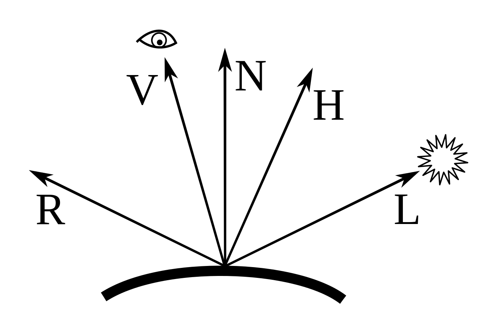
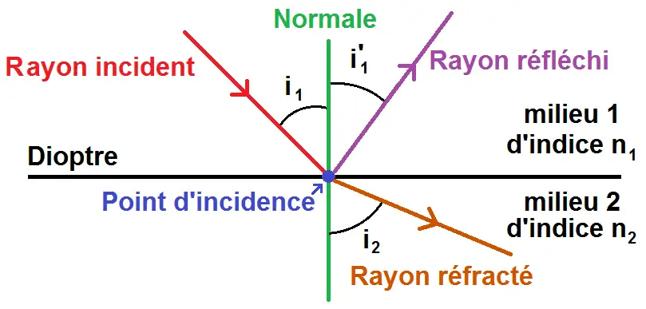
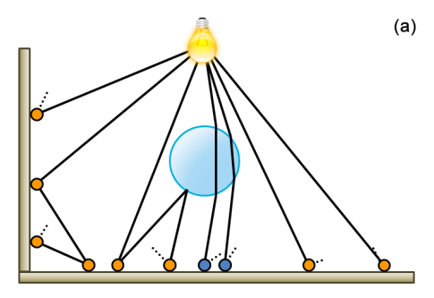
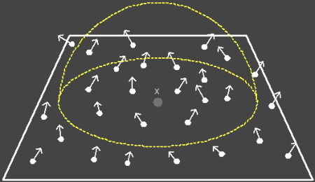
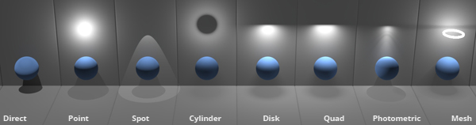

# I. État de l'art

## 1.1. Modèles d'éclairement
La couleur est une phénomène qui dépend, d'une part, de la physique de la lumière et son interaction avec les matériaux, d'autre part, de l'interprétation des phénomènes résultats par le système visuel humain.

### 1.1.1. La système visuelle d'humain

#### 1.1.1.1. L'oeil humain

<p style="text-align: center">
  
  <br>
  Figure 1: Coupe de l'oeil humain
</p>

La figure 1 présente une coupe de l'oeil humain. L'iris joue le rôle du diaphragme de l'appareil photographique et la pupille celui de la lentile. L'image se forme sur la rétine qui est la surface de l'oeil sensible à la lumière. Sur la rétine, il existe deux types de cellules photo céceptrices qui transforment la lumière en impulsions nerveuses: les cônes et les bâtonnets. Les bâtonnets sont plus sensibles à la lumière que les cônes et permettent la vision nocturne. Les cônes servent à la vision des couleurs et à la vision diurne.


Il existe trois type de cônes, qui diffèrent suivant leur sensibilité aux longueurs d'ondes: certains sont sensibles aux courtes longueurs d'ondes (cônes bleus), les autres ont une sensibilité maximale à 535 nm (cônes verts) ou à 575 nm (cônes rouges).

#### 1.1.1.2. Le mécanisme visuel

Le mécanisme visuel correspond au schéma suivant: un stimulus externe provoque l'activation d'un cône ou d'un bâtonnet qui produit une transition photochimique, laquelle induit de l'influx nerveux. Les impulsions nerveuses fournis par les cônes sont recombinées en trois nouveaux canaux: le premier indique la luminance, le deuxième la différence entre le rouge et le vert et le troisième la différence entre le jaune et le bleu.

### 1.1.2. Modèles locaux

Depuis des années, la synthèse d'images s'applique à définir des modèles de réflexion simulant le plus fidèlement possible la réponse d'un matériau quelconque à une incidence lumineuse. Cependant, l'interaction entre la lumière et la matière est un problème très difficile à modéliser parfaitement en raison de sa complexité. Maintenant, cette interaction est appliquée à de nombreux objectifs tels que la simulation physique ou le rendu temps réel. Et un des techniques qu'on utilise souvent pour ce calcul est la fonction de BRDF.

#### 1.1.2.1. Définition de la BRDF

<p style="text-align: center">
  
  <br>
  Figure 2: Le modèle de BRDF
</p>

La luminance est une mesure radiométrique définissant la qualité d'énergie, dans notre cas l'énergie lumineuse, qui est émise ou reçue par une surface élémentaire dans un angle solide élémentaire autour d'une direction donnée. La luminance s'exprime en Watts par unité d'aire et par unité d'angle solide $W.m^{-2}.sr^{-1}$. L'énergie qui arrive sur une portion de surface dans une portion d'angle solide *$d\omega_i$*:

$$dL_i(x, \omega_i) = L_i(x, \omega_i) cos(\vec{N_x}, \omega_i) d\omega_i$$ 

avec:

+ $L_i(x, \omega_i)$ est l'énergie reçcue en x
+ $\omega_i$ est la direction d'éclairement
+ $\vec{N_x}$ est la normale de surface
+ $d\omega_i$ est l'angle solide


La fonction de distribution de la réflectance bidirectionnelle (BRDF) décrit la réflextion d'une onde lumineuse sur une surface. En effet, pour une direction d'éclairement *$\omega_i$* et une direction de réflexion *$\omega_r$*, la BRDF est le rapport de la luminance réflechie en un point *x* d'une surface infinitésimale d'aire *dA* à l'éclairement incident à celle-ci.

$$f_r(x, \omega_i, \omega_r, \lambda) = f_r(x, \theta_i, \phi_i, \theta_r, \phi_r, \lambda) = \frac{dL_r(x,\theta_r, \phi_r, \lambda)}{dL_i(x, \theta_i, \phi_i, \lambda)} = \frac{dL_r(x,\theta_r, \phi_r, \lambda)}{L_i(x, \theta_i, \phi_i, \lambda) cos\theta_i d\omega_i}$$

avec:

+ $\theta_i$ est l'angle entre $\omega_i$ et $\vec{N_x}$
+ $\theta_r$ est l'angle entre $\omega_r$ et $\vec{N_x}$

#### 1.1.2.2. Le modèle de Lambert

<p style="text-align: center">
  
  <br>
  Figure 3: Lambertian reflectance
</p>

Le modèle de Lambert, qui suppose une surface parfaitement diffuse. C'est-à-dire que la lumière est réflechie de façon équiprobable par le matériau dans toutes les directions. La BRDF est donc constante et indépendante des directions d'éclairement, de réflexion, et de la longueur d'onde:

$$f_r(\omega_i,\omega_r) = \frac{1}{\pi}$$

En réalité, les surfaces ne réflechissent qu'une partie de la lumière (l'autre étant absorbée). C'est pourquoi on utilise parfois le modèle suivantpour caractériser une surface dite Lambertienne:

$$f_r(\omega_i,\omega_r) = \frac{C}{\pi}$$

avec:\
$C$ est le longueur d'onde de la lumière 

#### 1.1.2.3. Le modèle de Phong

<p style="text-align: center">
  
  <br>
  Figure 4: Les vecteurs utilisé dans le modèle de Phong
</p>

Le modèle de Phong est le modèle le plus utilisé en synthèse d'image. Ce modèle est basé sur la combinaison linéaire d'un comportement diffus et d'un comportement directionnelle. La BRDF est représenté par cette formule:

$$f(\vec{L}, \vec{V}) = k_d + k_s \frac{ F_s(\vec{L}, \vec{V})}{(\vec{N}.\vec{L})}$$

avec:
* $\vec{L}$ est la direction à la lumière
* $\vec{V}$ est la direction de reflexion
* $\vec{N}$ est la normale de surface
* $k_d$ est la couleur diffuse de l'objet
* $k_s$ est la couleur spéculaire de l'objet

Le terme $F_s(\vec{L}, \vec{V})$ est appelé lobe spéculaire. Il peut être exprimée de plusieurs manières. Originalement, Phong avait proposé l'expression suivant:

$$F_s^P(\vec{L}, \vec{V}) =  \left\{ \begin{array}{rcl}
  (\vec{R}.\vec{V})^n & si \quad \vec{R}.\vec{V} > 0  \\ 0 & sinon 
  \end{array} \right.  $$

avec:
* $\vec{V}$ est la direction de réflexion en réelle
* $\vec{R}$ est la direction de réflexion définie par la première loi de Descarte; et exprimée par: $\vec{R} = 2(\vec{L}.\vec{N})\vec{N} - \vec{L}$
* $n$ est la rugosité de la surface. Plus n est grand, plus la surface apparaît lisse.

Dans la première loi de Descartes, quand un rayon de lumière $\vec{L}$ contacte un surface, il va génère un rayon de réflexion $\vec{R_1}$ et un rayon de réfraction $\vec{R_2}$. Les relation entre ces rayons sont répresenté par ces équations:

$$i_1 = i_1'$$
$$n_1 Sin(i_1) = n_2 Sin (i_2)$$

avec:
* $i_1$ est l'angle entre le rayon entré et la normale
* $i_1'$ est l'angle entre le rayon de réflexion et la normale
* $i_2$ est l'angle entre le rayon de réfraction et la normale
* $n_1$ est l'indice de réfraction de milieu 1
* $n_2$ est l'indice de réfraction de milieu 2

<p style="text-align: center">
  
  <br>
  Figure 5: La première loi de Dsecartes
</p>

L'indice de réfraction est la ratio entre la vitesse de la lumière dans la vide et dans un milieu considèré. Il est exprimée par cette formule:

$$n = \frac{c}{v}$$

avec:
* $c$ est la vitesse de la lumière dans le vide, environ $3.10⁸ m.s^{-1}$
* $v$ est la vitesse de la lumière dans le milieu considèré

**Physiquement plausible**

Malgré que le modèle original de Phong est utilisé dans beaucoup de système de rendu, ce modèle n'adapte pas les facteurs physiques suivant: 
* La conservation d'énergie: BRDF $ \le$ 1
* La réciprocité: $f(\vec{L}, \vec{V}) = f(\vec{V}, \vec{L})$

Afin de rendre le modèle de Phong physiquement plausible, en 1993, Lewis nous a proposé ensemble de constraintes sur les paramètres permettant de respecter la conservation d'énergie. 

$$k_d + k_s \le 1$$ 

Le problème de la réciprocité peut être résoudre par utiliser le terme spéculaire proposé par Blinn. 

**Modèle Blinn-Phong**

À côté de l'expression du terme spéculaire proposé par Phong, il existe aussi une autre expression de ce terme. Ci-dessous, c'est la formule proposé par Blinn:

$$ F_s^B(\vec{L}, \vec{V}) = (\vec{N}.\vec{H})^n $$

avec:
* $\vec{H}$ est le vector à mi-distance entre $\vec{V}$ et $\vec{L}$

#### 1.1.2.3. L'équation de Fresnel

L'équation de Fresnel est une équation utilisé pour calculer l'énergie de réflexion et l'énergie de réfraction au cas où la lumière contacte un matériel transparent tels que la verre ou l'eau. La lumière est composée de deux ondes perpendiculaires que nous appelons la lumière polarisée parallèle et perpendiculaire. On a deux équation de Fresnel:

$$ F_{R\parallel} = \left(\frac{n_2 Cos \theta_1 - n_1 Cos \theta_2 }{ n_2 Cos \theta_1 + n_1 Cos \theta_2 } \right)²  $$

$$ F_{R\perp} = \left(\frac{n_2 Cos \theta_2 - n_1 Cos \theta_1 }{ n_2 Cos \theta_2 + n_1 Cos \theta_1 } \right)²  $$

avec:
* $\theta_1$ est l'angle entre le rayon d'éclairement et la normale
* $\theta_2$ est l'angle entre le rayon de réflexion et la normale
* $n_1$ est l'indice de réfraction de milieu 1
* $n_2$ est l'indice de réfraction de milieu 2

Par calculer le moyenne de ces deux valeurs, on obtiens le ratio entre l'énergie de réflexion et l'énergie d'émise:

$$ F_R = \frac{1}{2} (F_{ R\parallel} + F_{R\perp} ) $$

Grâce à la conservation d'énergie, on peut calculer le ratio entre l'énergie de réfraction et l'énergie d'émise:

$$F_T = 1 - F_R$$


#### 1.1.2.4. Les autres fonctions de BxDF

À côté de la fonction BRDF, il existe aussi des autres fonctions qui s'adaptent aux différents type de matériaux, tels ques:

+ *Bidirectional Transmittance Distribution Function (BTDF):* Le cas où la lumière est réfracté complètement

+ *Bidirectional Scattering Distribution Function (BSDF):* Le cas où une partie de la lumière est diffusée tandis que l'autre est réfracté.

+ *Bidirectional Sous-Surfaque Reflectance Distribution Function (BSSRDF):* Le cas où la lumière est diffusée sous la surface d'un matériel (la peau).

### 1.1.3. Modèles globaux

Dans la section avant, on a vu le modèle qui permet de calculer l'éclairement d'une surface de manière locale, c'est-à-dire sans prendre en compte la participation de l'ensemble des objets constituant une scène dans l'apparence d'un seul objet. En effet, elle ne prennent en compte que la réflexion directe des sources de lumières, alors que la lumière peut subir plusieurs réflexions avant d'atteindre un objet. 

*L'équation de rendu*

L'expression de la lumière $L(x \rightarrow \omega)$ émise en une point *x* d'une surface et dans une direction $\omega$ est répresenté par:

$$ L (x \rightarrow \omega) = L_e(x \rightarrow \omega) + L_r(x \rightarrow \omega)  $$

avec:
* $L_e(x \rightarrow \omega)$ est la luminance propre émise (comme pour une source de lumière)
* $L_r(x \rightarrow \omega)$ est la réflexion de toute la lumière qui arrive sur cette surface

On sait que la réflexion est contrôlée par la fonction BRDF: 

$$ f_r (x, \omega \rightarrow \omega') = \frac{L_r(x \rightarrow \omega)}{L(x \leftarrow \omega')|cos(\vec{N_x}, \omega')|d\omega'}  $$

avec:
* $\omega$ est la direction de réflexion
* $\omega'$ est la direction d'éclarement
* $\vec{N_x}$ est la normale de surface
* $L_r(x \rightarrow \omega)$ est la réflexion de toute la lumière qui arrive sur cette surface
* $L(x \leftarrow \omega')$ est la luminance reçue dans la direction $\omega$'

On a l'équation de rendu au final:

$$ L (x \rightarrow \omega) = L_e(x \rightarrow \omega) + \int_{\Omega} f_r (x, \omega \rightarrow \omega')L(x \leftarrow \omega')|cos(\vec{N_x}, \omega')|d\omega'   $$


## 1.2. Photon Mapping

Le Photon Mapping est la méthode utilisé beaucoup dans les simulations d'interception de la lumière. Il y a deux phases principales dans cette technique, ce sont:
* *Photon Tracing:* Construire la carte de photon
* *Photon Collecting:* Estimer l'énergie lumineuse de chaque pixel d'image

### 1.2.1. Photon Tracing

<p style="text-align: center">
  
  <br>
  Figure 6: La phase de Photon Tracing
</p>

Afin de cosntruire la carte de photon, on va lancer plusieurs rayons à partir des sources de lumières et stocker des impacts de chaque rélfexions, ainsi que leurs énergie $\phi$ en Watts (W). Ces impacts sont les *photons* dans notre carte de photon. Si l'émission de N échantillons est guidée par la densité de probabilité $p(x, \omega)$, l'énergie de chaque photon est calculer par cette équation:

$$ \phi = \frac{L(x \rightarrow \omega) |cos(\vec{N_x}, \omega)|}{Np(x,\omega)} $$

avec:
* $N$ est le nombre d'échantions
* $L(x \rightarrow \omega)$ est l'énergie reçue en *x*
* $\vec{N_x}$ est la normale du surface 
* $\omega$ est la direction d'éclairement
* $p(x, \omega)$ est la densité de probabilité (PDF)

Ci-dessous, ce sont des valeurs de PDF qui corresponds quelques cas d'échantillonage:

* Échantillonnage d'une direction uniforme sur une sphère-unité centrée : $p(\omega) = 1/(4\pi)$
* Échantillonnage d'une direction uniforme sur une demi sphère-unité centrée : $p(\omega) = 1/(2\pi)$
* Échantillonnage d'une direction selon le cosinus à la normale : $p(\omega) = |cos(\vec{N}, \omega)|/\pi$
* Échantillonnage d'une direction uniforme d'un triangle d'aire A : $p(\omega) = 1/A$


### 1.2.2. Photon Collecting

<p style="text-align: center">
  
  <br>
  Figure 7: La phase de Photon Collecting
</p>

Après d'obtenir la carte de photon, on va l'utiliser pour faire le rendu d'image. Pour chaque pixel d'image, on va lancer un rayon à partir de caméra, puis calculer le point d'intersection *x* entre ce rayon et tous les objets dans la scène. Si S est la surface qui contiens *x* et $p_i$ est la position du $i^{me}$ photon d'énergie $\phi_i$, l'énergie reçue en Watts est: 

$$E = \sum_{p_i \in S }\phi_i$$

ou, en Watts par mètre carré, avec A est l'aire de la surface S:

$$ I = \frac{1}{A}\sum_{p_i \in S }\phi_i$$

# II. Implémentation 

Tous les codes d'implémentation est trouvé sur le Github de Aurélien Besnier dans la lien suivant : https://github.com/AurelienBesnier/photon_mapping 

## 2.1. Matériel

Avant d'implémenter des différents type de matériels, il faut d'implémenter la classe BxDF qui contiens des méthodes de calculer la réflexion de la lumière. Ensuite, toutes les classes de matériels vont héritées cette classe. Maintenant, dans notre projet, on a déjà défini 3 types de BxDF, ce sont:
* **Diffuse :** La réflexion diffuse est parait sur les surface non polies où la lumière est réfléchie dans plusieurs directions. Il est impossible d'avoir un image claire en observant un objet sur ce type de surface
* **Specular :** La réflexion spéculaire est une réflexion régulière de la lumière. Contrairement à la réflexion diffuse, elle ne peut exister que si les rayons lumineux rencontrent une surface parfaitement plane ou polie tels ques les miroirs ou une surface d'eau parfaitement calme
* **Captor :** Ce type de BxDF n'influence pas la calculation de lumière dans la simulation. Il est utilisé seulement pour capturer l'énergie lumineuse dans une région déterminé.   

```cpp
enum class BxDFType {
    DIFFUSE, ///< Diffuse surface
    SPECULAR, ///< Specular surface
    CAPTOR ///< Captor surface
};
```
Ci-dessous, c'est l'implémentation raccourcie de la classe BxDF. Il contient un constructor, une fonction de calculer le BxDF et une fonction d'échantillonner la direction de réflexion. La version complète de ce code est trouvé ici: https://github.com/AurelienBesnier/photon_mapping/blob/main/src/cpp/include/material.hpp#L49

```cpp
class BxDF {
private:
    BxDFType type; ///< The type of BxDF.

public:
    explicit BxDF(const BxDFType &type) : type(type) {}

    // evaluate BxDF
    virtual Vec3f evaluate(Vec3f &wo, Vec3f &wi,
                           TransportDirection &transport_dir) const = 0;

    // sample direction by BxDF.
    // its pdf is proportional to the shape of BxDF
    virtual Vec3f sampleDirection(Vec3f &wo,
                                  TransportDirection &transport_dir,
                                  Sampler &sampler, Vec3f &wi,
                                  float &pdf) const = 0;
};
```
Dans notre projet, on utilise 4 types de matériels pour construire l'environnement de cette simulation:
* Lambert
* Transparent
* Feuil
* Captor

### 2.1.1. Matériel de Lambert

Le matériel de Lambert est un type de matériel très basique dans notre projet. Il est utilisé pour répresetner la plupart des objets dans la scène tels ques les murs ou la table. 

$$f_r(\omega_i,\omega_r) = \frac{C}{\pi}$$

https://github.com/AurelienBesnier/photon_mapping/blob/main/src/cpp/include/material.hpp#L123

```cpp
class Lambert : public BxDF {
private:
    Vec3f rho;

public:
    explicit Lambert(const Vec3f &rho) : BxDF(BxDFType::DIFFUSE), rho(rho) {}

    Vec3f evaluate(Vec3f &wo, Vec3f &wi,
                   TransportDirection &transport_dir) const override {
        // when wo, wi is under the surface, return 0
        const float cosThetaO = cosTheta(wo);
        const float cosThetaI = cosTheta(wi);
        if (cosThetaO < 0 || cosThetaI < 0) return {0};

        return rho / PI;
    }

    Vec3f sampleDirection(Vec3f &wo,
                          TransportDirection &transport_dir,
                          Sampler &sampler, Vec3f &wi,
                          float &pdf) const override {
        // cosine weighted hemisphere sampling
        wi = sampleCosineHemisphere(sampler.getNext2D(), pdf);

        return evaluate(wo, wi, transport_dir);
    }
};
```

La densité de probabilité (pdf) dans *la partie 1.2.1* est calculer par ce code:

$$p(\omega) = \frac{|cos(\vec{N}, \omega)|}{\pi}$$

https://github.com/AurelienBesnier/photon_mapping/blob/main/src/cpp/include/sampler.hpp#L103

```cpp
inline Vec3f sampleCosineHemisphere(Vec2f uv, float &pdf) {
    float theta = 0.5f * std::acos(boost::algorithm::clamp(1.0f - 2.0f * uv[0],
                                                           -1.0f, 1.0f));
    float phi = PI_MUL_2 * uv[1];
    float cosTheta = std::cos(theta);
    pdf = PI_INV * cosTheta;
    Vec3f cart = sphericalToCartesian(theta, phi);
    return cart;
}
```

### 2.1.2. Matériel de transparence

Comme le matériel de Lambert, le matériel de transparence est aussi un matériel très basique. Il est utilisé pour répresenter les matériaux qui permettent la lumière de traverser tels ques les verres, l'eau, etc.

https://github.com/AurelienBesnier/photon_mapping/blob/main/src/cpp/include/material.hpp#L404

```cpp
class Transparent : public BxDF {
private:
    Vec3f rho;
    float ior;

public:
    Transparent(const Vec3f &rho, float ior)
            : BxDF(BxDFType::DIFFUSE), rho(rho), ior(ior) {}

    // NOTE: delta function
    Vec3f evaluate(Vec3f &wo, Vec3f &wi,
                   TransportDirection &transport_dir) const override {
        const float cosThetaO = cosTheta(wo);
        const float cosThetaI = cosTheta(wi);
        if (cosThetaO < 0 || cosThetaI < 0) return {0};

        return rho / PI;
    }

    Vec3f sampleDirection(Vec3f &wo,
                          TransportDirection &transport_dir,
                          Sampler &sampler, Vec3f &wi,
                          float &pdf) const override {
        // set appropriate ior, normal
        float iorO, iorI;
        Vec3f n;
        if (wo[1] > 0) {
            iorO = 1.0f;
            iorI = ior;
            n = Vec3f(0, 1, 0);
        } else {
            iorO = ior;
            iorI = 1.0f;
            n = Vec3f(0, -1, 0);
        }

        // fresnel reflectance
        const float fr = fresnelR(dot(wo, n), iorO, iorI);

        // reflection
        if (sampler.getNext1D() < fr) {
            wi = reflect(wo, n);
            pdf = 1.0f;

            //bxdf = rho / PI
            //pdf = cosTheta / PI
            //===> bxdf / pdf = rho / cosTheta
            return rho / absCosTheta(wi);
        }
            // refraction
        else {
            Vec3f tr;
            if (refract(wo, n, iorO, iorI, tr)) {
                wi = tr;
                pdf = 1.0f;

                float scaling = 1.0f;
                if (transport_dir == TransportDirection::FROM_CAMERA) {
                    scaling = (iorO * iorO) / (iorI * iorI);
                }

                return scaling * rho / absCosTheta(wi);
            }
                // total reflection
            else {
                wi = reflect(wo, n);
                pdf = 1.0f;
                return rho / absCosTheta(wi);
            }
        }
    }

};
```

### 2.1.3. Matériel de feuil et de capteur

L'implémentation de ces deux matériaux est pareil que celle de matériel de transparence, sauf que l'ior (index of reflectance) de feuil est 1.425 et l'ior de capteur est 1. 

L'article concernant l'ior de feuil: https://opg.optica.org/ao/abstract.cfm?uri=ao-13-1-109

## 2.2. Lumière

<p style="text-align: center">
  
  <br>
  Figure 8: Des types de source de la lumière
</p>

Dans un moteur de rendu, il existe plusieurs types de sources de la lumière qui va nous donner des résultats différents de rendu en appliquant dans la scène. Afin de simuler ces types de lumière, on va échantillonner des rayons de lumière qui partent de ces sources. Chaque rayon de lumière peut être répresenté par ces facteurs:

* Le point de départ
* La direction de la lumière
* L'énergie lumineuse de ce rayon

Ci-dessous, c'est l'implémentation de lumière en général. Il va contenir une variable pour stocker l'énergie totale de cette source en Watt, des fonctions pour générer le point de départ ainsi que la direction de rayon.  

https://github.com/AurelienBesnier/photon_mapping/blob/main/src/cpp/include/light.hpp#L23C1-L37C3

```cpp
class Light {
public:
    virtual ~Light() = default;

    /**
    * @fn Vec3f Le() override
    * Get the light emission of the light source.
    * @returns the le attribute.
    */
    virtual Vec3f Le() = 0;

    virtual SurfaceInfo samplePoint(Sampler &sampler, float &pdf) = 0;

    virtual Vec3f sampleDirection(const SurfaceInfo &surfInfo, Sampler &sampler, float &pdf) = 0;
};
```

Dans cette simulation, on a déjà implémenté 4 types de lumières correspondant à 4 stratégies d'échantillonage de lumière, ce sont:

* Point Light
* Spot Light
* Tube Light
* Area Light

## 2.3. Scène

La classe de la scène est la classe qui faire des liens entre tous les données de géometries, de matériaux et de lumière pour créer une simulation. 

https://github.com/AurelienBesnier/photon_mapping/blob/main/src/cpp/include/scene.hpp#L151C1-L166C80

Les tableaux qui contiennent les données de géometries.

```cpp
  std::vector<float> vertices;   ///< The vertices of the scene.
  std::vector<uint32_t> indices; ///< The indices of the scene.
  std::vector<float> normals;    ///< The normals of the scene.
  std::vector<Triangle> triangles; ///< The triangles of the scene per face.
```
Le tableau qui contiennent les données de matériaux.

```cpp
  std::vector<boost::optional<tinyobj::material_t>>
      materials; ///< The materials of the scene.
```

Les tableaux qui contiennent les données de lumière ainsi le BxDF pour chaque triangle.

```cpp
  std::vector<boost::shared_ptr<BxDF>>
      bxdfs; ///< The bxdfs of the scene per face.

  std::vector<boost::shared_ptr<Light>>
      lights; ///< The lights of the scene per face.

  std::vector<Primitive> primitives; ///< The primitives of the scene per face.
```

### 2.3.1. Ajouter de la lumière dans la scène

Ci-dessous, c'est la fonction d'ajouter un source de lumière dans la scène. Cependant, les variables *newVertices* et *newIndices* répresentent la forme de géometrie de source (un point, un cylinder, etc). L'intensité et la couleur répresentent l'énergie lumineuse en Watts et le longueur d'onde de la lumière.

https://github.com/AurelienBesnier/photon_mapping/blob/main/src/cpp/include/scene.hpp#L380C3-L426C4

```cpp
  void addLight(std::vector<float> newVertices,
                std::vector<uint32_t> newIndices, std::vector<float> newNormals,
                float intensity, Vec3f color) {
    for (uint32_t &i : newIndices) {
      i += nVertices();
    }
    this->vertices.insert(std::end(this->vertices), std::begin(newVertices),
                          std::end(newVertices));
    this->indices.insert(std::end(this->indices), std::begin(newIndices),
                         std::end(newIndices));
    this->normals.insert(std::end(this->normals), std::begin(newNormals),
                         std::end(newNormals));

    // populate  triangles
    for (size_t faceID = nFaces() - (newIndices.size() / 3); faceID < nFaces();
         ++faceID) {
      tinyobj::material_t m;

      m.diffuse[0] = color[0];
      m.diffuse[1] = color[1];
      m.diffuse[2] = color[2];
      m.ambient[0] = 0;
      m.ambient[1] = 0;
      m.ambient[2] = 0;
      m.emission[0] = color[0] * (intensity);
      m.emission[1] = color[1] * (intensity);
      m.emission[2] = color[2] * (intensity);
      m.specular[0] = 0.00;
      m.specular[1] = 0.00;
      m.specular[2] = 0.00;
      m.dissolve = 1.0;
      m.illum = 1;

      this->materials.emplace_back(m);

      // populate BxDF
      const auto material = this->materials[faceID];
      if (material) {
        tinyobj::material_t m = material.value();
        this->bxdfs.push_back(createBxDF(m));
      }
      // default material
      else {
        this->bxdfs.push_back(createDefaultBxDF());
      }
    }
  }
```

Après d'ajouter des sources de lumière par cette fonction, il faut d'appeler la fonction setupTriangles() pour qu'il puisse générer des *AreaLights* de ces sources. Chaque *AreaLight* va correspondre à un des triangles qui répresentent la forme de source de la lumière. D'autre part, cette fonction va stocker aussi les addresses des triangles, des lumières ainsi que des BXDF dans un dictionnaire, le tableau *primitives*. Cela va faciliter la recherche des données utilisées pour calculer la réflexion de la lumière dans les phases suivant.   

https://github.com/AurelienBesnier/photon_mapping/blob/main/src/cpp/include/scene.hpp#L335C1-L368C4

```cpp
  void setupTriangles() {
    // populate  triangles
    for (size_t faceID = 0; faceID < nFaces(); ++faceID) {
      // add triangle
      this->triangles.emplace_back(this->vertices.data(), this->indices.data(),
                                   this->normals.data(), faceID);
    }

    // populate lights, primitives
    for (size_t faceID = 0; faceID < nFaces(); ++faceID) {
      // add light
      boost::shared_ptr<Light> light = nullptr;
      const auto material = this->materials[faceID];
      // std::cout << "material check" << std::endl;
      if (material) {
        tinyobj::material_t m = material.value();
        light = createAreaLight(m, &this->triangles[faceID]);
        if (light != nullptr) {
          lights.push_back(light);
        }
      }
      // add primitive
      // std::cout << "Adding primitives" << std::endl;
      primitives.emplace_back(&this->triangles[faceID], this->bxdfs[faceID],
                              light);
    }
    // std::cout << "Triangles setup! " << std::endl;

#ifdef __OUTPUT__
    std::cout << "[Scene] vertices: " << nVertices() << std::endl;
    std::cout << "[Scene] faces: " << nFaces() << std::endl;
    std::cout << "[Scene] lights: " << lights.size() << std::endl;
#endif
  }
```

### 2.3.2. Ajouter des autres objets dans la scène

Voici la fonction d'ajouter les autres objets que la lumière à la scène. Cependant, les variables *vertices* et *indices* sont répresenté la géometrie.  

```cpp
void addFaceInfosMat(std::vector<float> vertices,
                       std::vector<uint32_t> indices,
                       std::vector<float> normals, Material mat) {
    for (uint32_t &i : indices) {
      i += nVertices();
    }
    this->vertices.insert(std::end(this->vertices), std::begin(vertices),
                          std::end(vertices));
    this->indices.insert(std::end(this->indices), std::begin(indices),
                         std::end(indices));
    this->normals.insert(std::end(this->normals), std::begin(normals),
                         std::end(normals));

    // populate materials
    for (size_t faceID = nFaces() - (indices.size() / 3); faceID < nFaces();
         ++faceID) {
      tinyobj::material_t m;

      m.diffuse[0] = mat.diffuse[0];
      m.diffuse[1] = mat.diffuse[1];
      m.diffuse[2] = mat.diffuse[2];
      m.ambient[0] = mat.ambient[0];
      m.ambient[1] = mat.ambient[1];
      m.ambient[2] = mat.ambient[2];
      m.emission[0] = 0.00;
      m.emission[1] = 0.00;
      m.emission[2] = 0.00;
      m.specular[0] = mat.specular[0];
      m.specular[1] = mat.specular[1];
      m.specular[2] = mat.specular[2];
      m.shininess = mat.shininess;
      m.dissolve = 1.0f - mat.transparency;
      m.ior = mat.ior;
      if (mat.transparency > 0)
        m.illum = 7;
      else
        m.illum = mat.illum;
      this->materials.emplace_back(m);
      // populate BxDF
      const auto material = this->materials[faceID];
      if (material) {
        tinyobj::material_t m = material.value();
        this->bxdfs.push_back(
            createBxDF(m, mat.reflectance, mat.transmittance, mat.roughness));
      }
      // default material
      else {
        this->bxdfs.push_back(createDefaultBxDF());
      }
    }
  }
```

Dans ce code, après de stocker tous les vertices et triangles ainsi que le matériel dans la scène, on va générer un BxDF pour chaque triangle du maillage. Cela va nous aider à calculer la réflexion sur chaque triangle plus facile.

https://github.com/AurelienBesnier/photon_mapping/blob/main/src/cpp/include/scene.hpp#L32C1-L66C2

```cpp
boost::shared_ptr<BxDF> createBxDF(tinyobj::material_t &material,
                                   float reflectance = 0.0f,
                                   float transmittance = 0.0f,
                                   float roughness = 0.5f) {
  const Vec3f kd =
      Vec3f(material.diffuse[0], material.diffuse[1], material.diffuse[2]);
  const Vec3f ks =
      Vec3f(material.specular[0], material.specular[1], material.specular[2]);

  if (material.illum == 2 && (ks == Vec3fZero)) {
    material.illum = 1;
  }

  switch (material.illum) {
  case 2:
    return boost::make_shared<Mirror>(ks);
  case 5:
    // mirror
    return boost::make_shared<Mirror>(Vec3f(1.0f));
  case 6:
    // leaf
    material.ior = 1.425f; // Source:
    // https://opg.optica.org/ao/abstract.cfm?uri=ao-13-1-109
    return boost::make_shared<Leaf>(kd, material.ior, roughness);
  case 7:
    // Transparent
    return boost::make_shared<Transparent>(kd, material.ior);
  case 9:
    return boost::make_shared<Refltr>(kd, reflectance, transmittance,
                                      roughness);
  default:
    // lambert
    return boost::make_shared<Lambert>(kd);
  }
}
```

### 2.3.3. Calculer d'intersection

Afin de calculer l'intersection entre un rayon et tous les triangles dans la scène, on utilise la bibliothèque de Embree. En effet, d'abord, on construire un scène de Embree avec tous les tableux des données de géometrie et de matériel. Ensuite, on utilise la fonction *rtcIntersect1* de Embree pour obtenir la résultat de l'intersection. 

https://github.com/AurelienBesnier/photon_mapping/blob/main/src/cpp/include/scene.hpp#L687C3-L721C4

```cpp
void build() {
#ifdef __OUTPUT__
    std::cout << "[Scene] building scene..." << std::endl;
#endif

    // setup embree
    device = rtcNewDevice(nullptr);
    scene = rtcNewScene(device);

    rtcSetSceneBuildQuality(scene, RTC_BUILD_QUALITY_MEDIUM);
    rtcSetSceneFlags(scene, RTC_SCENE_FLAG_ROBUST);

    RTCGeometry geom = rtcNewGeometry(device, RTC_GEOMETRY_TYPE_TRIANGLE);

    // set vertices
    float *vb = (float *)rtcSetNewGeometryBuffer(
        geom, RTC_BUFFER_TYPE_VERTEX, 0, RTC_FORMAT_FLOAT3, 3 * sizeof(float),
        nVertices());
    for (size_t i = 0; i < vertices.size(); ++i) {
      vb[i] = vertices[i];
    }

    // set indices
    uint32_t *ib = (uint32_t *)rtcSetNewGeometryBuffer(
        geom, RTC_BUFFER_TYPE_INDEX, 0, RTC_FORMAT_UINT3, 3 * sizeof(uint32_t),
        nFaces());
    for (size_t i = 0; i < indices.size(); ++i) {
      ib[i] = indices[i];
    }

    rtcCommitGeometry(geom);
    rtcAttachGeometry(scene, geom);
    rtcReleaseGeometry(geom);
    rtcCommitScene(scene);
  }
```

https://github.com/AurelienBesnier/photon_mapping/blob/main/src/cpp/include/scene.hpp#L730C1-L777C4

```cpp
  bool intersect(const Ray &ray, IntersectInfo &info) const {
    RTCRayHit rayhit{};
    rayhit.ray.org_x = ray.origin[0];
    rayhit.ray.org_y = ray.origin[1];
    rayhit.ray.org_z = ray.origin[2];
    rayhit.ray.dir_x = ray.direction[0];
    rayhit.ray.dir_y = ray.direction[1];
    rayhit.ray.dir_z = ray.direction[2];
    rayhit.ray.tnear = 0;
    rayhit.ray.tfar = std::numeric_limits<float>::infinity();
    rayhit.ray.mask = -1;

    rayhit.ray.flags = 0;
    rayhit.hit.geomID = RTC_INVALID_GEOMETRY_ID;
    rayhit.hit.instID[0] = RTC_INVALID_GEOMETRY_ID;
    rayhit.hit.instPrimID[0] = RTC_INVALID_GEOMETRY_ID;

    RTCRayQueryContext context;
    rtcInitRayQueryContext(&context);
    RTCIntersectArguments args;
    rtcInitIntersectArguments(&args);
    args.context = &context;

    rtcIntersect1(scene, &rayhit, &args);

    if (rayhit.hit.geomID != RTC_INVALID_GEOMETRY_ID) {
      info.t = rayhit.ray.tfar;

      // get triangle shape
      const Triangle &tri = this->triangles[rayhit.hit.primID];

      // set surface info
      info.surfaceInfo.position = ray(info.t);
      info.surfaceInfo.barycentric = Vec2f(rayhit.hit.u, rayhit.hit.v);
      info.surfaceInfo.geometricNormal = tri.getGeometricNormal();
      info.surfaceInfo.shadingNormal =
          tri.computeShadingNormal(info.surfaceInfo.barycentric);
      orthonormalBasis(info.surfaceInfo.shadingNormal, info.surfaceInfo.dpdu,
                       info.surfaceInfo.dpdv);

      // set primitive
      info.hitPrimitive = &this->primitives[rayhit.hit.primID];

      return true;
    } else {
      return false;
    }
  }
```

## 2.4. Carte de Photon

Dans la carte de photon, chaque photon contiens l'énergie lumineuse en Watts, la position de photon, la direction de la lumière vers la surface et l'index du triangle contenant le photon. 

https://github.com/AurelienBesnier/photon_mapping/blob/main/src/cpp/include/photon_map.hpp#L15

```cpp
struct Photon {
    Vec3f throughput;  ///< BxDF * Cos Term / pdf
    Vec3f position; ///< The position of the photon in the scene
    Vec3f wi;  ///<  incident direction
    unsigned int triId = 0; ///<  id of the triangle on which the photon ended up
};
```

La carte de photon peut être stocker sous la forme d'un KdTree ou un tableau.

## 2.5. Photon Tracing

Le pseudocode de la phase de Photon Tracing:

```cpp
  nb_sample = 10000000;
  maxDepth = 100;

  for l: 0 -> nb_light:
    for s: 0 -> nb_sample/nb_light:
      #Échantionner un rayon de lumière
      for k: 0 -> maxDepth:
        #Calculer l'intersection entre le rayon et des triangles de la scène 
        if le rayon intersect un matériel de type Diffuse:
          #Ajouter un photon à la carte de photon
        if k > 0:
          if le test de propabilité de Russian Roulette est réussit:
            #Terminer algo
        #Calculer le rayon de réflexion suivant
```

**Échantionnage un rayon de lumière**

Pour cette étape, on va choisir aléatoirement un source de la lumière dans la scène, un point de la surface de cette source et une direction. Ensuite, on va calculer l'énergie lumineuse avec l'équation dans la *section 1.2.1*. 

$$ \phi = \frac{L(x \rightarrow \omega) |cos(\vec{N_x}, \omega)|}{Np(x,\omega)} $$

```cpp
// sample initial ray from light and compute initial throughput
static Ray sampleRayFromLight(const Scene &scene, Sampler &sampler, Vec3f &throughput) {
	// sample light
	float light_choose_pdf;
	boost::shared_ptr<Light> light = scene.sampleLight(sampler,
				light_choose_pdf);

	// sample point on light
	float light_pos_pdf;
	SurfaceInfo light_surf = light->samplePoint(sampler, light_pos_pdf);

	// sample direction on light
	float light_dir_pdf;
	Vec3f dir = light->sampleDirection(light_surf, sampler, light_dir_pdf);

	// spawn ray
	Ray ray(light_surf.position, dir);
	Vec3f le = light->Le();

	throughput = le / (light_choose_pdf * light_pos_pdf * light_dir_pdf)
				* std::abs(dot(dir, light_surf.shadingNormal));

	return ray;
}
```

**Le test de propabilité de Russian Roulette**

https://github.com/AurelienBesnier/photon_mapping/blob/main/src/cpp/include/integrator.hpp#L499C8-L507C44

```cpp
if(k > 0) {  
  const float russian_roulette_prob = std::min(
  					    std::max(throughput[0],
  					    std::max(throughput[1], throughput[2])), 1.0f);
  if (sampler_per_thread.getNext1D() >= russian_roulette_prob) {
  	break;
  }
  throughput /= russian_roulette_prob;
}
```
Il y a un remarque sur cette implémentation de Russian Roulette. C'est que la probabilité de Russian Roulette est toujour égale 1 si l'énergie lumineuse de rayon (throughput) est supérieur de 1. C'est-à-dire que cette partie de Russian Roulette n'influence pas la calcul de lumière jusqu'à le temps où l'énergie lumineuse est très petite (inférieur de 1).

**Calculer le rayon de réflexion suivant**

https://github.com/AurelienBesnier/photon_mapping/blob/main/src/cpp/include/integrator.hpp#L510C7-L525C49

```cpp
// sample direction by BxDF
Vec3f dir;
float pdf_dir;
const Vec3f f = info.hitPrimitive->sampleBxDF(
    -ray.direction, info.surfaceInfo,
		TransportDirection::FROM_LIGHT, sampler_per_thread, dir, pdf_dir);
// update throughput and ray
if (!is_captor)
	throughput *= f
			* cosTerm(-ray.direction, dir, info.surfaceInfo, TransportDirection::FROM_LIGHT)
			/ pdf_dir;
ray = Ray(info.surfaceInfo.position, dir);
```

## 2.6. Photon Collecting

Dans cette phase, pour chaque pixel de l'image, on va lancer un rayon qui part de la caméra et calculer le point de contact avec la scène. Ensuite, il faut de chercher un nombre de photons qui sont proche de ce point pour estimer l'énergie lumineuse émise en ce point. Cette valeur de l'énergie lumineuse correspond la couleur du pixel d'image.

$$ I = \frac{1}{A}\sum_{p_i \in S }\phi_i$$

https://github.com/AurelienBesnier/photon_mapping/blob/main/src/cpp/include/integrator.hpp#L78C1-L97C3

```cpp
	// compute reflected radiance with global photon map
	Vec3f computeRadianceWithPhotonMap(const Vec3f &wo,
			IntersectInfo &info) const {
		// get nearby photons
		float max_dist2;
		const std::vector<int> photon_indices =
				globalPhotonMap.queryKNearestPhotons(info.surfaceInfo.position,
						nEstimationGlobal, max_dist2);

		Vec3f Lo;
		for (const int photon_idx : photon_indices) {
			const Photon &photon = globalPhotonMap.getIthPhoton(photon_idx);
			const Vec3f f = info.hitPrimitive->evaluateBxDF(wo, photon.wi,
					info.surfaceInfo, TransportDirection::FROM_CAMERA);
			Lo += f * photon.throughput;
		}
		if (!photon_indices.empty()) {
			Lo /= (nPhotonsGlobal * PI * max_dist2);
		}
		return Lo;
	}
```


## 2.7. La programme principal

Pour s'adapter au serveur MorphoNet, on exportit tous les codes C++ des parties avant à un bibliothèque Python avec un wrapper Python. Ci-dessous, c'est les codes à construire la simulation d'interception de lumière dans la chambre de culture. (plantglRadScene)

https://github.com/AurelienBesnier/photon_mapping/blob/main/examples/python/plantgl-rad-scene/planglRadScene.py#L1124C1-L1151C52

```cpp
#ajouter des objets à la scène

materialsR, materialsT = setup_dataset_materials(w)
scene.clear()
captor_dict = {}
for sh in sc:
    add_shape(scene, sh, w, materialsR, materialsT)
tr2shmap = {}
addCaptors(scene, captor_dict, "captors/captors_expe1.csv")
scene.setupTriangles()

#initialiser la scène de Embree

scene.build()

#initialiser le photon mapping

print("Building photonMap...")
integrator = PhotonMapping(
    n_photons,
    n_estimation_global,
    n_photons_caustics_multiplier,
    n_estimation_caustics,
    final_gathering_depth,
    max_depth,
)

#construire la carte de photon

sampler = UniformSampler(random.randint(1, sys.maxsize))
integrator.build(scene, sampler, False)
```

# Reférences
* [1] Bernard Péroche, Dominique Bechmann. Informatique garaphique et rendu. Lavoisier, 2007.
* [2] Schill, Steven & Jensen, John & Raber, George & Porter, Dwayne. (2004). Temporal Modeling of Bidirectional Reflection Distribution Function (BRDF) in Coastal Vegetation. GIScience & Remote Sensing. 41. 116-135. 10.2747/1548-1603.41.2.116. 
* [3] https://opg.optica.org/ao/abstract.cfm?uri=ao-13-1-109
* [4] Lewis, Robert. (2001). Making Shaders More Physically Plausible. Computer Graphics Forum. 13. 10.1111/1467-8659.1320109. 