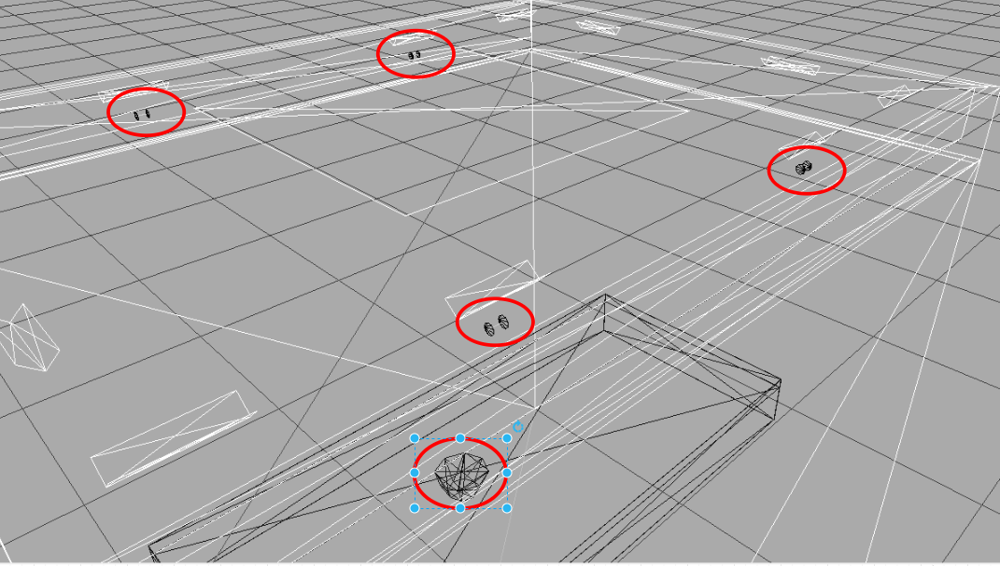

## 1. Échantillonage de la lumière

Comme on a sait, afin d'échantillonage un rayon de lumière, il faut: 

* Échantionner un point de départ
* Échantionner la direction de la lumière
* Calculer l'énergie lumineuse de ce rayon par BRDF

On a déjà vu le façcon pour calculer l'énergie lumineuse de rayon dans la partie avante. Maintenant, je vais vous montrer le pipeline pour échantionner le point de départ et la direction de la lumière.

Dans la simulation d'interception de la lumière, il y a deux temps où on doit faire l'échantillonage d'un nouveau rayon: 

* Le rayon d'éclairement qui part d'un source de la lumière 
* Le rayon de réflexion qui part d'un surface 

Pour le rayon d'éclairement, on va avoir des différents stratégies d'échantillonnage correspondant les formes de la source de lumière. Pourtant, dans notre projet, par définir la forme de la source de lumière sous la forme un tableau des triangles, et considèrer chaque triangle est un source de lumière, on peut répresenter tous les types de lumière.

D'autre part, les surfaces des objets dans la scène sont aussi représenté sous la forme d'un triangle. Alors, dans notre projet, on n'considère que l'échantillonage le rayon sur un triangle.

### 1.1. Échantionner un point de départ

<p style="text-align: center">
  
  <br>
  Figure 1: Les coordonnées barycentriques
</p>

Les coordonnées d'un point d'un triangle sont représentées par les coordonnées barycentrique:

$$P = uA + vB + wC$$

avec:

* A,B et C sont des coordonnées des coins de triangle
* u, v et w sont calculer par ces formules:
$$ u = \frac{Area_{CAP}}{Area_{ABC}} $$
$$ v = \frac{Area_{ABP}}{Area_{ABC}} $$
$$ w = \frac{Area_{BCP}}{Area_{ABC}} $$

Donc, en échantionnant aléatoirement trois valeurs u,v et w, on va obtenir un point sur le triangle. Les contraints de ces trois valeurs:

$$ u + v + w = 1 $$
$$ 0 \leq u, v, w \leq 1 $$ 

```cpp
// sample point on the triangle
SurfaceInfo Triangle::samplePoint(Sampler &sampler, float &pdf) const {
  SurfaceInfo ret;

  Vec3ui vidx = getIndices();

  Vec3f p1 = getVertexPosition(vidx[0]);
  Vec3f p2 = getVertexPosition(vidx[1]);
  Vec3f p3 = getVertexPosition(vidx[2]);

  // sample point on triangle
  Vec2f uv = sampler.getNext2D();
  float su0 = std::sqrt(uv[0]);
  Vec2f barycentric = Vec2f(1.0f - su0, uv[1] * su0);
  ret.position = (1.0f - barycentric[0] - barycentric[1]) * p1 +
                 barycentric[0] * p2 + barycentric[1] * p3;

  // compute normal
  ret.shadingNormal = computeShadingNormal(barycentric);

  // compute dpdu, dpdv
  orthonormalBasis(ret.shadingNormal, ret.dpdu, ret.dpdv);

  ret.barycentric = barycentric;

  // compute pdf
  pdf = 1.0f / surfaceArea;

  return ret;
}
```

### 1.2. Échantionner une direction de la lumière

Comme on a sait, toutes les directions des rayons qui part d'un surface sont distribué sur un hemisphere. Alors, pour échantilloner une direction, d'abord, on va échantionner une direction d'un hemisphère supérieur. Ce hemispheère a la centre situé au (0,0,0) et le rayon est 1. Ensuite, on va appliquer une transformation de l'axe pour transformer l'axe Y (0,1,0) du hemisphere à la normal du surface.

```cpp
    Vec3f sampleDirection(const SurfaceInfo &surfInfo, Sampler &sampler, float &pdf) override {
        Vec3f dir = sampleCosineHemisphere(sampler.getNext2D(), pdf);
        Vec3f wo = localToWorld(dir, surfInfo.dpdu, surfInfo.shadingNormal, surfInfo.dpdv);

        // transform direction from local to world
        return wo;
    }
```

**Échantillonner une direction du hemisphère supérieur**

<p style="text-align: center">
  
  <br>
  Figure 2: Échantillonage d'une direction de hemisphere
</p>

Une direction de hemisphère est représentée par les deux angles $\theta$ et $\phi$

* $\phi$ est l'angle entre la projection de la direction sur la surface et l'axe X, entre $[ 0, 2\pi ]$
* $\theta$ est l'angle entre la direction et l'axe Z, entre $[-\frac{\pi}{2}, \frac{\pi}{2}]$

En échantillonnant aléatoirement ces deux angles, on va obtenir une direction.

```cpp
inline Vec3f sampleCosineHemisphere(Vec2f uv, float &pdf) {
    float theta = 0.5f * std::acos(boost::algorithm::clamp(1.0f - 2.0f * uv[0],
                                                           -1.0f, 1.0f));
    float phi = PI_MUL_2 * uv[1];
    float cosTheta = std::cos(theta);
    pdf = PI_INV * cosTheta;
    Vec3f cart = sphericalToCartesian(theta, phi);
    return cart;
}
```

**Transformation de système coordonnée**

Après d'obtenir une direction de hemisphère, il faut de faire une transformation de système de coordonnées pour qu'on puisse calculer l'intersection de ce rayon avec tous les objet dans la scène.

Voici l'implémentation des fonction de cette transformation.

```cpp
// transform direction from world to local
inline Vec3f worldToLocal(const Vec3f &v, const Vec3f &lx, const Vec3f &ly,
                          const Vec3f &lz) {
    return {dot(v, lx), dot(v, ly), dot(v, lz)};
}


// transform direction from local to world
inline Vec3f localToWorld(Vec3f v, Vec3f lx, Vec3f ly, Vec3f lz) {
    Vec3f ret;
    for (int i = 0; i < 3; ++i) {
        ret[i] = v[0] * lx[i] + v[1] * ly[i] + v[2] * lz[i];
    }
    return ret;
}
```

Les vecteur $l_x$, $l_y$ et $l_z$ dans ce code sont les vecteurs orthogonals qui construire le système de coordonnées. Par examples, pour le système de coordonnées local, les trois vecteurs sont $l_x = (1,0,0)$ , $l_y = (0,1,0)$ et $l_z = (0,0,1)$.

Pour chaque surface dans la scène, vecteur $l_y$ est la normale de surface et les autres vecteurs sont calculées par utiliser le cross produit.

```cpp
inline void orthonormalBasis(Vec3f &n, Vec3f &t, Vec3f &b) {
    if (std::abs(n[1]) < 0.9f) {
        t = normalize(cross(n, Vec3f(0, 1, 0)));
    } else {
        t = normalize(cross(n, Vec3f(0, 0, -1)));
    }
    b = normalize(cross(t, n));
}
```

## 2. Le problème des normales de surfaces

Après de lancer la simulation avec 10 millions photons, je trouve qu'il y a aucun photon contacté avec les capteurs en hauteurs 1000 et 1400.

<p style="text-align: center">
  
  <br>
  Figure 3: Le résultat de simulation courant
</p>


Pour trouver le problème de cette erreur, j'ai déjà fait quelques tests. D'abord, je lance seulement 1 photon par lumière (8 en total) et log tous les directions, l'énergie lumineuse, etc. Et je trouve que le photon tracing est terminé très tôt, après 2 ou 3 fois de réflexion, l'énergie lumineuse va devenir (0,0,0) car le BRDF est 0. 

Voici l'implémentation de BRDF de Lambert.

```cpp
    Vec3f evaluate(Vec3f &wo, Vec3f &wi,
                   TransportDirection &transport_dir) const override {
        // when wo, wi is under the surface, return 0
        const float cosThetaO = cosTheta(wo);
        const float cosThetaI = cosTheta(wi);
        if (cosThetaO < 0 || cosThetaI < 0) return {0};

        return rho / PI;
    }
```

Le BRDF de matériel Lambert est devenu 0 si la couleur de matériel est noir, autrement dit si l'albédo de matériel est (0,0,0). Quand j'ai cherché des objets noirs dans le fiche .rad, il y a seulement des plateaux situé aux deux bouts de lamp et le pots qui sont noirs. Pourtant, après j'ai supprimé ces objets, le résultat n'est encore pas changé.

<p style="text-align: center">
  
  <br>
  Figure 4: Les objets noirs dans la scène
</p>

Dans cette implémentation, il existe un autre cas où le BRDF deviens 0, c'est le cosine de l'angle $\theta_i$ et $\theta_o$ sont inférieur 0, autrement dit, la direction situe au dessous de la surface XOY. **C'est la raison pour laquelle notre BRDF est devenu 0 très rapidement**. Pourtant, en théorie, il n'existe pas ce cas car tous de nos directions unité sont situé dans le hemisphere supérieur.

<p style="text-align: center">
  
  <br>
  Figure 5: les directions du hemisphere supérieur 
</p>

Après de debugger plus loin, je trouve la cause de cette phenomen. C'est quand on fait la transformation du système de coordonnées de monde au celui de local pour faire des calculs de BRDF, puis faire la transformation inverse pour calculer des intersections, la direction originale de rayon est modifié. En effet, j'ai modifié le code pour examiner la fonction *localToWorld* et *worldToLocal* d'un vecteur après d'échantillonnage sur hemisphere supérieur, j'obtiens ces résultats:

<p style="text-align: center">
  
  <br>
  Figure 6: les resultat du test de transformation de système de coordonnées 
</p>

On peut voir que il y a 7 par 8 vectors modifé après d'appliquer la transformation de système de coordonnées.

*Le code modifié*

```cpp
    Vec3f sampleDirection(const SurfaceInfo &surfInfo, Sampler &sampler, float &pdf) override {
        Vec3f dir = sampleCosineHemisphere(sampler.getNext2D(), pdf);
        Vec3f wo = localToWorld(dir, surfInfo.dpdu, surfInfo.shadingNormal, surfInfo.dpdv);
        Vec3f wi = worldToLocal(wo, surfInfo.dpdu, surfInfo.shadingNormal, surfInfo.dpdv);

        std::cout << dir << std::endl;
        std::cout << wi << std::endl;
        if( length(dir - wi) > 0.0001 ){
            std::cout << "err" << std::endl;
        }
        // transform direction from local to world
        return wo;
    }
```

Comme on a déjà vu dans la partie avante, tous les calculs de transformation de système de coordonnées sont lié beaucoup à la normale de surface. Alors, si la normale n'est pas correct, notre fontion de transformtion n'est aussi pas correct.

Dans notre simulation, on calcule tous les normals de triangles automatiquement par OpenAlea.PlantGL après de définir tous les vertices et les ordres de vertices des triangles. Le problème que je trouve est dans cette phase. En fait, c'est quand on defini la forme de cylinder d'une source de lumière. 

Le code pour faire des vertices 

```cpp
if type == "cylinder":
    l = re.split(r"\s+|;+", lines[i + 1])
    l2 = re.split(r"\s+|;+", lines[i + 2])
    l3 = re.split(r"\s+|;+", lines[i + 3])
    r = float(l3[0]) / scale_factor

    x, y, z = (
        float(l[0]) / scale_factor,
        float(l[1]) / scale_factor,
        float(l[2]) / scale_factor,
    )
    x2, y2, z2 = (
        float(l2[0]) / scale_factor,
        float(l2[1]) / scale_factor,
        float(l2[2]) / scale_factor,
    )
    vert.append((x + r, y + r, z + r))
    vert.append((x - r, y - r, z - r))
    vert.append((x2 + r, y2 + r, z2 + r))
    vert.append((x2 - r, y2 - r, z2 - r))
```

le code pour faire des triangles 

```cpp
    ts = TriangleSet(vert)
    i = 0
    indList = []
    while i < nbCoords:
        if invert_normals:
            ind = Index3(i, i + 2, i + 1)
            ind2 = Index3(i, i + 3, i + 2)
        else:
            ind = Index3(i, i + 1, i + 2)
            ind2 = Index3(i, i + 2, i + 3)
        indList.append(ind)
        indList.append(ind2)
        i += 4
    
    ts.indexList = Index3Array(indList)
    ts.computeNormalList()
```

En fait, après de lire dans le fiche .rad, on obtiens deux points correspondant la longueur de lamp. Pour créer un carré, on ajoute 4 point autour les deux points comme dans l'image suivante.

<p style="text-align: center">
  
  <br>
  Figure 7: Ajouter des vertices
</p>

Ensuite, on définir un ordre de chaque group de 3 vertices pour créer des triangles.

<p style="text-align: center">
  
  <br>
  Figure 8: Créer des triangles
</p>

Ci-dessus, c'est le résultat de notre code courant et il est facile d'aperçevoir que ce n'est pas bon.

Pour tester si la transformation de système de coordonnées est bon avec des bonnes triangles, j'ai modifie les ordres des triangles un peu.

```cpp
vert.append((x + r, y + r, z + r))       
vert.append((x2 + r, y2 + r, z2 + r))
vert.append((x2 - r, y2 - r, z2 - r))
vert.append((x - r, y - r, z - r))
```

<p style="text-align: center">
  
  <br>
  Figure 9: Modifier les ordre des vertices
</p>

Voici les résultats.

<p style="text-align: center">
  
  <br>
  Figure 10: Resultat avec des bonnes triangles
</p>

On peut voir que les résultats sont très bien. Pourtant, dans notre simulation, à côté de la lumière, il y a beaucoup d'objets qui a la forme d'un carré et cela influence aussi à la simulation.

**Dans la semaine prochaine, je vais essayer à corriger ces erreurs pour voir si le résultat de simulation est amélioré.**