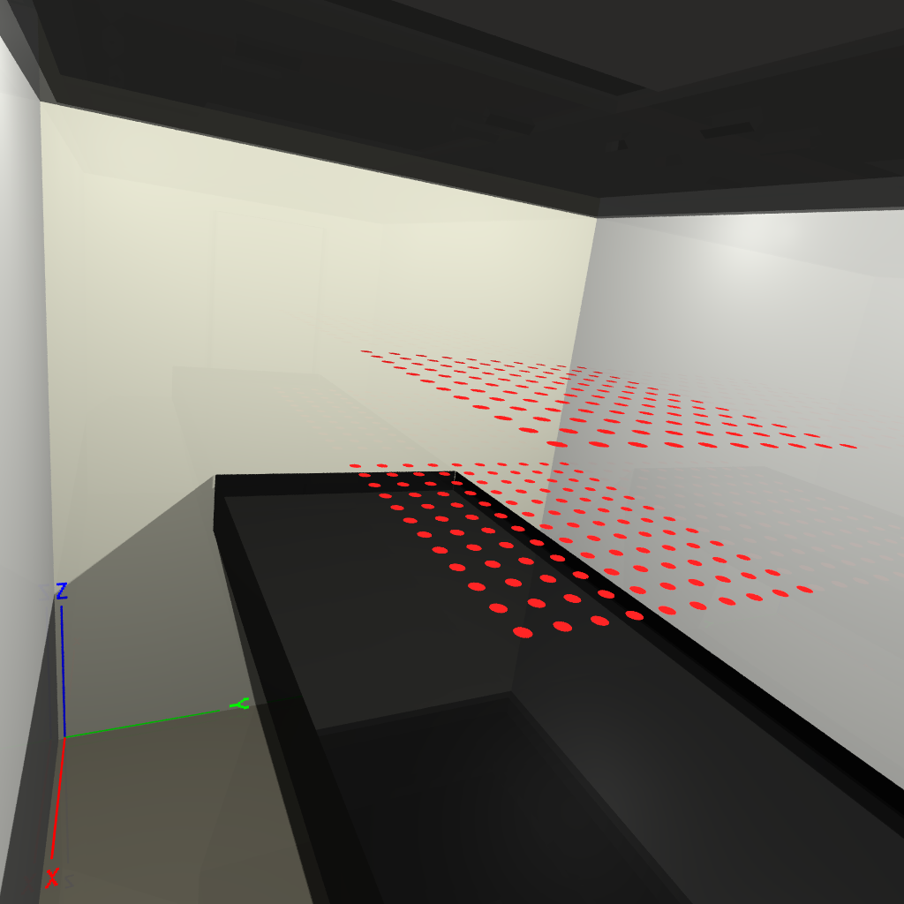
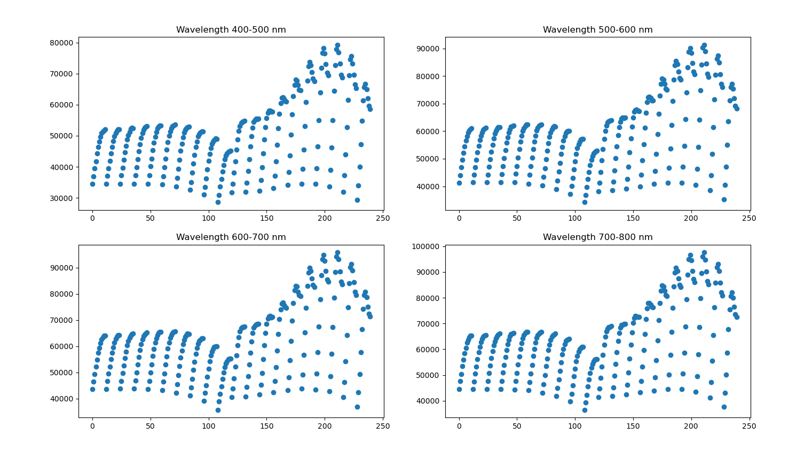
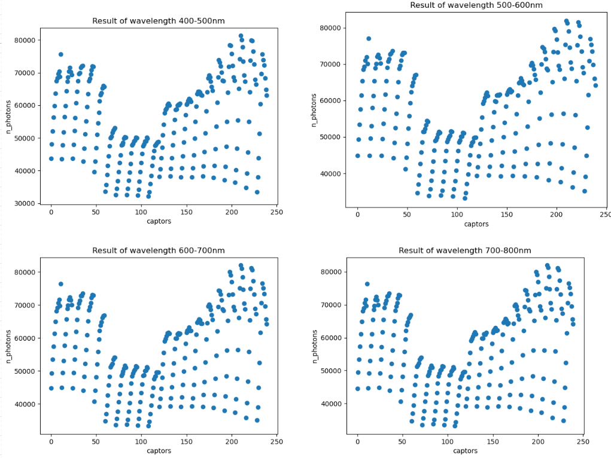

## 1. Rappel du modèle de Phong

<p style="text-align: center">
  
  <br>
  Figure 1: Les vecteurs utilisé dans le modèle de Phong
</p>

**Modèle de Phong**

La BRDF de Phong est représenté par cette formule:

$$f(\vec{L}, \vec{V}) = k_d(\vec{N}.\vec{L}) + k_s F_s(\vec{L}, \vec{V})$$

avec:

* $\vec{L}$ est la direction à la lumière
* $\vec{V}$ est la direction de reflexion
* $\vec{N}$ est la normale de surface
* $k_d$ est la coefficient (couleur) diffuse de l'objet
* $k_s$ est la coefficient (couleur) spéculaire de l'objet

Le terme $F_s(\vec{L}, \vec{V})$ est appelé lobe spéculaire. Il peut être exprimée de plusieurs manières. Originalement, Phong avait proposé l'expression suivant:

$$F_s^P(\vec{L}, \vec{V}) =  \left\{ \begin{array}{rcl}
  (\vec{R}.\vec{V})^n & si \quad \vec{R}.\vec{V} > 0  \\ 0 & sinon 
  \end{array} \right.  $$

avec:

* $\vec{V}$ est la direction de réflexion en réelle
* $\vec{R}$ est la direction de réflexion définie par la première loi de Descarte; et exprimée par: $\vec{R} = 2(\vec{L}.\vec{N})\vec{N} - \vec{L}$
* $n$ est la rugosité de la surface. Plus n est grand, plus la surface apparaît lisse.

**Modèle de Blinn-Phong**

À côté de l'expression du terme spéculaire proposé par Phong, il existe aussi une autre expression de ce terme. Ci-dessous, c'est la formule proposé par Blinn:

$$ F_s^B(\vec{L}, \vec{V}) = (\vec{N}.\vec{H})^n $$

avec:

* $\vec{H}$ est le vector à mi-distance entre $\vec{V}$ et $\vec{L}$

## 2. Implémentation du modèle de Phong

Voici un example de matériel dans le fichier .rad.

```cpp
void metal MiroirCaissonLampes
0
0
5
0.564 0.564 0.564 0.400 0
```

J'ai considéré les propriétés du modèle de Phong comme les valeurs que j'ai déjà lu dans le fichier .rad. Dans l'example au dessus, le $k_d = (0.564,0.564,0.564)$, le $k_s = (0.4, 0.4, 0.4)$ et la rugosité $n = 0$

D'autre part, on obtiens aussi la reflectance qui correspond à la propriété optic de chaque matériel dans les fichier .csv (excel).

Je suis un peu confusé avec ce valeur car je ne sais pas ce valeur correspondant à quel variable du modèle de Phong. Alors, j'ai utilisé ce valeur pour faire un test de probabilité de decider si le photon est absorbé. Et calculer le BRDF avec les valeurs dans le fichier .rad.

**Si possible, je voudrais voir le source code de SEC2 pour savoir comment il implémente la modèle de Phong**

```cpp
    Vec3f evaluate(Vec3f &wo, Vec3f &wi,
                   TransportDirection &transport_dir) const override {
        // when wo, wi is under the surface, return 0
        const float cosThetaO = cosTheta(wo);
        const float cosThetaI = cosTheta(wi);

        if (cosThetaO < 0 || cosThetaI < 0) return {0};
        
        Vec3f normal = Vec3f(0,1,0);
        Vec3f refl = reflect(wo, normal);
        float lobeSpecular = dot(refl, wi);
        
        if(lobeSpecular > 0) {
            lobeSpecular = std::pow(lobeSpecular, roughness);
        } else {
            lobeSpecular = 0;
        }

        return rho * dot(normal, wo) + lobeSpecular * specular;
    }
    
    Vec3f sampleDirection(Vec3f &wo,
                          TransportDirection &transport_dir,
                          Sampler &sampler, Vec3f &wi,
                          float &pdf) const override {

        // cosine weighted hemisphere sampling
        wi = sampleCosineHemisphere(sampler.getNext2D(), pdf);
        
        if(sampler.getNext1D() < reflectance) {
            return evaluate(wo, wi, transport_dir);
        } else {
            return 0;
        }
    }
```

## 2. Evaluation le résultat

<p style="text-align: center">
  
  <br>
  Figure 2: Les capteurs de la première simulation de SEC2
</p>

Dans la première simulation de SEC2, on lance 10¹⁰ photons sur 12 bandes de longueur d'onde dans la chambre de culture avec les capteurs:

* 400-445 nm
* 445-455 nm
* 455-500 nm
* 500-534 nm
* 534-542 nm
* 542-600 nm
* 600-655 nm
* 655-665 nm
* 665-700 nm
* 700-725 nm
* 725-735 nm
* 735-800 nm

Afin de tester notre code plus vite, on simplifie la simulation. On va faire la simulation sur 4 bandes: 400-500, 500-600, 600-700 et 700-800. Pour chaque bande de longueur d'onde, on lance 10⁹ photons. Ensuite, on va dessiner un diagramme pour voir la distribution de photons sur ces capteurs.

Voici le résultat de SEC2:

<p style="text-align: center">
  
  <br>
  Figure 3: Le résultat de SEC2
</p>

Il y a quelques choses qu'on peut noter sur ce résultat.

* le nombre de photon sur capteur est augmenté si le coordonné x de position est augementé. (110 à 1210)
* plus haut le capteur situé, plus de photons le capteur reçoit

Voici notre résultat courant:

<p style="text-align: center">
  
  <br>
  Figure 3: Le résultat courant
</p>

On peut voir que presque toute la distribution de photons dans notre résultat est similaire au résultat de SEC2. Pourtant, les 5 premières lignes de capteurs sont reçu plus de photons, même plus de photons sur les capteurs du deuxième hauteur.

**Je suis en train de trouver la raison de cette phenomen**


## 3. Problèmes existés

**Performance**

Dans le test avec 10⁹ photons, cela me prends **plus d'un heure** pour obtenir le résultat. Je vais essayer à utiliser le **SYCL** pour lancer la simulation en GPU et voir si cela diminue le temps nécessaire pour le calcul.

**Le valeur de reflectance**

Comme j'ai déjà dit dans le partie suivant, je ne suis pas très sûr que ce valeur corresponds à quel variable dans le modèle de Phong.

**Schema de simulation**

Est-ce que les capteurs dans la simulation peut **bloquer** le rayon de lumière? (Ray tracing va terminer après de toucher un capteur)

Dans la simulation, on va lancer 10¹⁰ photons **chaque** bande de longueur d'onde ou lancer 10¹⁰ **partagé** pour tous les bandes de longueur d'onde? 
